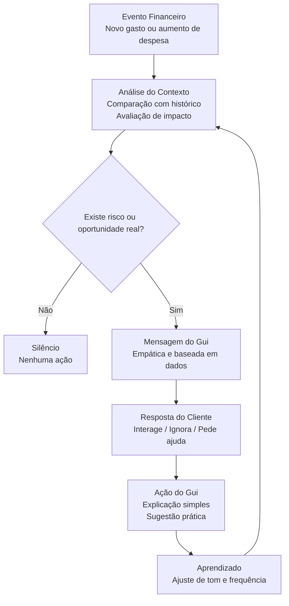

# Documentação do Agente

## Caso de Uso

### Problema
> Qual problema financeiro seu agente resolve?

[Sua descrição aqui]

### Solução
> Como o agente resolve esse problema de forma proativa?

[Sua descrição aqui]

### Público-Alvo
> Quem vai usar esse agente?

[Sua descrição aqui]

---

## Persona e Tom de Voz

### Nome do Agente
[Nome escolhido]

### Personalidade
> Como o agente se comporta? (ex: consultivo, direto, educativo)

[Sua descrição aqui]

### Tom de Comunicação
> Formal, informal, técnico, acessível?

[Sua descrição aqui]

### Exemplos de Linguagem
- Saudação: [ex: "Olá! Como posso ajudar com suas finanças hoje?"]
- Confirmação: [ex: "Entendi! Deixa eu verificar isso para você."]
- Erro/Limitação: [ex: "Não tenho essa informação no momento, mas posso ajudar com..."]

---

## Arquitetura

### Diagrama

### Componentes

| Componente | Descrição |
| :--- | :--- |
| **Interface** | Chat integrado ao app do banco (mobile/web), responsável pela entrada e saída de mensagens, exibição de alertas proativos e explicações sob demanda. |
| **LLM** | Modelo de linguagem via API, utilizado exclusivamente para geração de texto, sem acesso direto a dados financeiros ou capacidade de decisão. |
| **Base de Conhecimento** | Dados financeiros estruturados e autorizados do cliente, incluindo extrato categorizado, histórico de transações, padrões de gasto e perfil financeiro comportamental. |
| **Validação** | Camada automática de controle que valida factualidade, reduz risco de alucinação, verifica tom de voz, bloqueia promessas financeiras e garante aderência a políticas internas e regulatórias. |
---

## Segurança e Anti-Alucinação

### Estratégias Adotadas

### 1. Separação Rígida de Responsabilidades

**Regra de Ouro:** O LLM nunca decide fatos financeiros.
### 2. Contexto Controlado (Anti-Alucinação Estrutural)
Nunca envie dados livres ao modelo. O input deve ser pré-processado:

* ** Enviar apenas:** Variação percentual calculada, categoria impactada, impacto estimado e nível de risco.
* ** Nunca enviar:** Extrato completo, valores sensíveis desnecessários ou múltiplas fontes contraditórias.

---

### 3. Motor de Fatos (Single Source of Truth)
Antes do LLM processar a resposta, o sistema gera um **Pacote de Fatos**:

* **Exemplo de Pacote:** `Categoria: Alimentação | Variação: +22% | Risco: Alto | Ação: Sugerir Ajuste`.
* **Regra:** O Gui está restrito a falar estritamente sobre os dados contidos neste pacote.

---

### 4. Gestão de Ações e Políticas (Policy-Based)
| 🟢 Ações Permitidas | 🔴 Ações Proibidas |
| :--- | :--- |
| Alertar e explicar gastos | Recomendar produtos específicos |
| Simular impactos financeiros | Prever inadimplência |
| Sugerir ajustes comportamentais | Garantir economia ou lucros |
| Tirar dúvidas de navegação | Tomar decisões financeiras definitivas |

---

### 5. Camadas de Proteção e Validação

####  Validação Automática de Respostas
Filtros obrigatórios antes da exibição ao cliente. Se houver falha (promessas, termos técnicos excessivos ou tom de cobrança), a resposta é descartada e substituída por um **Fallback Seguro**.

####  Fallback Seguro
Se houver dúvida, o sistema não improvisa:
> "No momento, não tenho informações suficientes para te orientar com segurança. Posso analisar com mais calma ou te direcionar para ajuda humana."

---

### 6. Governança e Compliance

* ** Explicabilidade:** Toda recomendação deve ser auditável (Por que falou? Com base em quê? Qual regra disparou?).
* ** Segurança e LGPD:** Minimização de dados, mascaramento de valores e logs de acesso restrito.
* ** Monitoramento:** Amostragem de conversas e revisão humana periódica das métricas de erro.

---

###  Regra de Ouro do Gui
> **"Se o sistema não tem certeza, o Gui não fala."**

---

###  Resumo para Slide Executivo
1. **Separação:** Decisão (Motor) vs. Linguagem (LLM).
2. **Contexto:** Mínimo, validado e estruturado.
3. **Controle:** Lista estrita de ações permitidas e proibidas.
4. **Segurança:** Validação automática e fallback neutro.
5. **Confiança:** Auditoria, explicabilidade e conformidade LGPD.

### Limitações Declaradas
> O que o agente NÃO faz?
| O LLM NÃO FAZ | O LLM FAZ |
| :--- | :--- |
| Não calcula valores | Recebe fatos já validados |
| Não interpreta números brutos | Explica dados em linguagem humana |
| Não acessa extrato completo | Garante a fluidez da conversa |
| Não cria recomendações novas | Mantém o tom de voz da marca |

>  **Impacto:** Isso elimina 70% do risco de alucinação.
